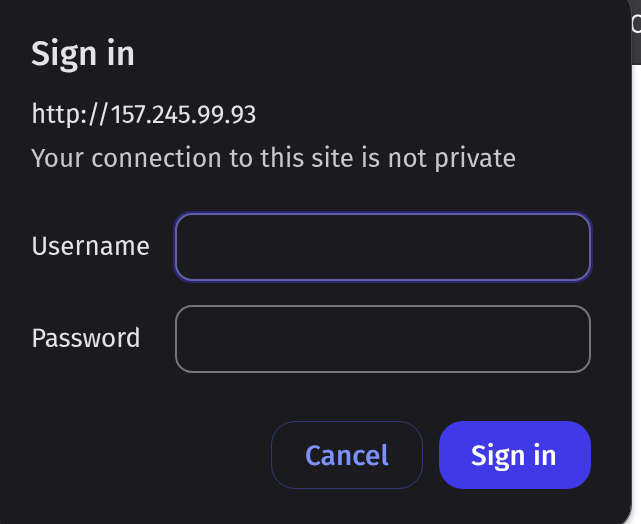
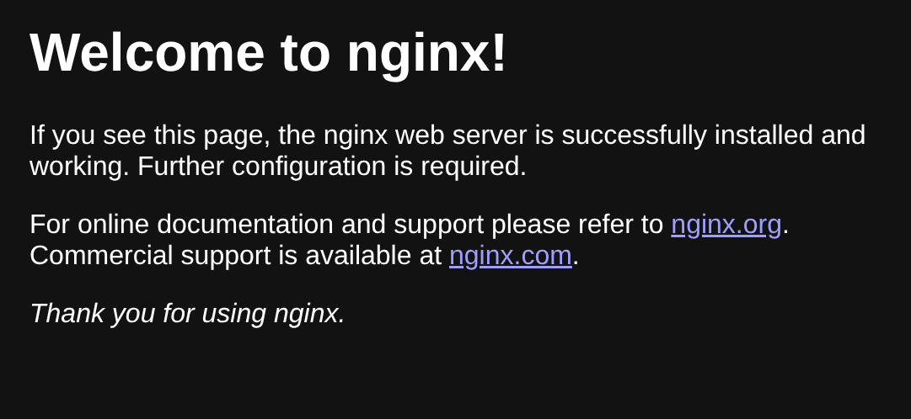

# Nginx Fail2Ban with nftables

## Ubuntu 24
### Install Nginx, Fail2ban, nftables
- Command:
    ```sh
    apt update && apt upgrade && apt install nginx fail2ban nftables sed -y
    ```
## Nginx
- We have to configure basic auth in Nginx configuration.
- We are using `openssl` command for this.

### Create Auth File:
- Create User:
    ```sh
    sh -c "echo -n 'sammy:' >> /etc/nginx/.htpasswd"
    ```
- Create Password. Below command will ask for password:
    ```sh
    sudo sh -c "openssl passwd -apr1 >> /etc/nginx/.htpasswd"
    ```

- Verify:
    ```sh
    cat /etc/nginx/.htpasswd
    ```
- Output will be similar to:
    ```sh
    sammy:$apr1$ZWYWJ8Q8$AJwPaqwa.plHKepkdUnEG/
    ```
- Here: username is `sammy` and password is also `sammy`.

### Modify Nginx configuration
- Command:
    ```sh
    sudo sed -i '/root \/var\/www\/html;/a \
            auth_basic "Restricted Content";\
            auth_basic_user_file /etc/nginx/.htpasswd;' /etc/nginx/sites-enabled/default
    ```

### Nginx Reload
```sh
systemctl reload nginx
```

## Nftables
- Command:
    ```
    mkdir -p /etc/nftables/
    cat > /etc/nftables/fail2ban.conf <<'EOF'
    #!/usr/sbin/nft -f

    table inet fail2ban {
        set banned_ips {
            type ipv4_addr;
            flags interval;
        }
        set banned_ips6 {
            type ipv6_addr;
            flags interval;
        }

        chain input {
            type filter hook input priority 0; policy accept;
            ip saddr @banned_ips drop
            ip6 saddr @banned_ips6 drop
        }
    }
    EOF
    sed -i '/flush ruleset/a include "/etc/nftables/fail2ban.conf"' /etc/nftables.conf
    ```

- Reload nftales:
    ```sh
    nft -f /etc/nftables.conf
    systemctl reload nftables
    ```

- Verify NFtables list:
    ```sh
    nft list tables
    ```

- Above command should show our `fail2ban` in a list like:
    ```sh
    table inet fail2ban
    table inet filter
    ```

## Fail2Ban:
- Configure `jail.local` file:
    ```sh
    cat > /etc/fail2ban/jail.local <<'EOF'
    [DEFAULT]
    # Use nftables
    banaction = nftables-multiport
    ignoreip  = 127.0.0.1/8 ::1/128

    # Global defaults
    bantime   = 1h       # Ban for 1 hour
    findtime  = 10m      # Look at last 10 minutes
    maxretry  = 3        # 3 failures → ban

    [sshd]
    enabled  = true
    port     = ssh
    logpath  = /var/log/auth.log
    backend  = systemd
    maxretry = 5
    findtime = 10m
    bantime  = 1h

    [nginx-http-auth]
    enabled  = true
    port     = http,https
    logpath  = /var/log/nginx/error.log
    backend  = polling
    maxretry = 3
    EOF
    ```

- In above config file, we are using `nftables` for autoban instead of `iptables`. Also we have added `localhost` ip in `ignoreip` list.
- We have add `nginx-http-auth` for basic testing purpose. `Fail2Ban` reads error logs from `/var/log/nginx/error.log` file which is `nginx` default error file.
- The config file for `nginx-http-auth` can be found in `/etc/fail2ban/filter.d` directory.

- Restart `Fail2ban`:
    ```sh
    systemctl restart fail2ban
    ```

- Verify Status of `nginx-http-auth`:
    ```sh
    fail2ban-client status nginx-http-auth
    ```

## Reload all services:
```sh
systemctl restart fail2ban
systemctl restart nginx
systemctl restart nftables
```

## Verify Fail2ban
- Visit Nginx Default Page. For me, my server IP is `157.245.99.93`.`
- Open Link: http://157.245.99.93
 
- We can try login with correct credentials.
 

- Now let's try with wrong password.
- Open Incognito mode in browser or switch browser.
- Open Link: http://157.245.99.93. Remember to replace value of server ip.
- Now try login with wrong credentials continuously 3 times. We must get banned.

### Check Status of `nginx-http-auth`
- Command:
    ```sh
    fail2ban-client status nginx-http-auth
    ```
- Output:
    ```sh
    Status for the jail: nginx-http-auth
    |- Filter
    |  |- Currently failed: 0
    |  |- Total failed:     3
    |  `- File list:        /var/log/nginx/error.log
    `- Actions
    |- Currently banned: 1
    |- Total banned:     1
    `- Banned IP list:   <my-ip-redacted>
    ```

- Ensure my ip is blocked by `nftables`.
- Command:
    ```sh
    nft list table inet f2b-table
    ```
- Output:
    ```sh
    table inet f2b-table {
            set addr-set-nginx-http-auth {
                    type ipv4_addr
                    elements = { <my-ip-redacted> }
            }

            chain f2b-chain {
                    type filter hook input priority filter - 1; policy accept;
                    tcp dport { 80, 443 } ip saddr @addr-set-nginx-http-auth reject with icmp port-unreachable
            }
    }
    ```

## UnBan IP:
- Unban ip from fail2ban:
    ```sh
    fail2ban-client set nginx-http-auth unbanip <my-ip-redacted>
    ```
- Once unbanned successfully, we can visit nginx page with no problem.


# References:
- Nginx Fail2ban: https://www.digitalocean.com/community/tutorials/how-to-protect-an-nginx-server-with-fail2ban-on-ubuntu-20-04
- Nginx Basic Auth: https://www.digitalocean.com/community/tutorials/how-to-set-up-password-authentication-with-nginx-on-ubuntu-20-04